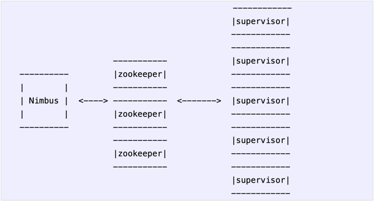
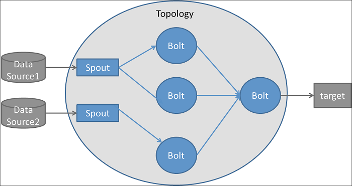

# Storm-Hello-World

```
[Problem]: Write a topology to just append World to the end of given stream, and also write contents to file to see the result.
```

Apache Storm is a distributed stream processing computation framework.

There are two kinds of nodes on a Storm cluster:
1. **Master node**
2. **Worker nodes**

- The master node runs a daemon called **Nimbus**.
    - **Nimbus** is responsible for distributing code around the cluster.
    - assigning tasks to machines 
    - and monitoring for failures.
    

- Each worker node runs a daemon called the **Supervisor**.
    - The supervisor listens for work assigned to its machine.
    - And starts and stops worker processes as necessary based 
      on what Nimbus has assigned to it.
      

- All coordination between Nimbus and the Supervisors is done through a **Zookeeper** cluster.
- Nimbus daemon and Supervisor daemons are **fail-fast** and **stateless**.
- All state is kept in Zookeeper or on local disk
- This means you can kill Nimbus or the Supervisors and they'll start back up like nothing happened.




## Streams

- A stream is an unbounded sequence of tuples.
- Storm provides the primitives for transforming a stream into a new stream in a distributed and reliable way.
- The basic primitives Storm provides for doing stream transformations:
    - **Spouts**: A spout is a source of streams in a topology. Generally spouts will read tuples from an external 
      source and emit them into the topology.
    - **Bolts**: A bolt _consumes_ any number of input streams, does some processing, and possibly emits new streams.
- Spouts and bolts have interfaces that you implement to run your application-specific logic.

## Topologies

- Networks of spouts and bolts are packaged into a **Topology**.
- A topology is a **graph** of stream transformations where each **node** is a spout or bolt.
- **Edges** in the graph indicate which bolts are subscribing to which streams.
- When a spout or bolt emits a tuple to a stream, it sends the tuple to every bolt that subscribed to that stream.





## Stream groupings

In the topology we have to specify for each bolt which streams it should receive as input. A stream grouping defines 
how that stream should be partitioned among the bolt's tasks.

There are **eight** built-in stream groupings in Storm, and you can implement a custom stream grouping by implementing 
the _**CustomStreamGrouping**_ interface:

1. **Shuffle grouping:** Tuples are randomly distributed across the bolt's tasks in a way such that each bolt is 
   guaranteed to get an equal number of tuples.


2. **Fields grouping:** The stream is partitioned by the fields specified in the grouping. For example, if the stream is grouped by the "user-id" field, tuples with the same "user-id" will always go to the same task, but tuples with different "user-id"'s may go to different tasks.


3. **Partial Key grouping:** he stream is partitioned by the fields specified in the grouping, like the Fields grouping, but are load balanced between two downstream bolts, which provides better utilization of resources when the incoming data is skewed.


4. **All grouping:** The stream is replicated across all the bolt's tasks.


5. **Global grouping:** The entire stream goes to a single one of the bolt's tasks. Specifically, it goes to the task with the lowest id.


6. **None grouping:** This grouping specifies that you don't care how the stream is grouped. Currently, none groupings are equivalent to shuffle groupings.


7. **Direct grouping:** This is a special kind of grouping. A stream grouped this way means that the producer of the tuple decides which task of the consumer will receive this tuple.


8. **Local or shuffle grouping:**     If the target bolt has one or more tasks in the same worker process, tuples will be shuffled to just those in-process tasks. Otherwise, this acts like a normal shuffle grouping.


## Key Points

- A topology runs forever, or until you kill it. 
- Storm will automatically reassign any failed tasks
- Storm guarantees that there will be no data loss, even if machines go down and messages are dropped.